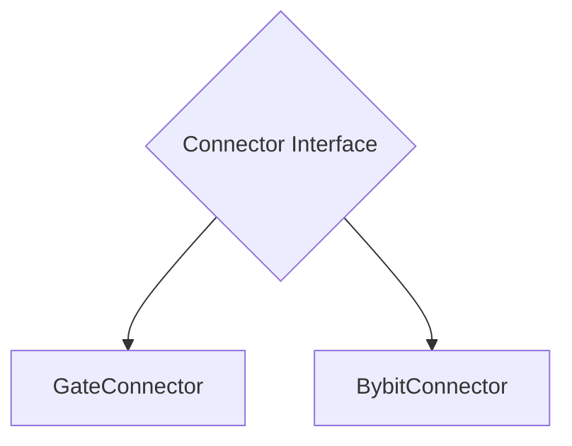
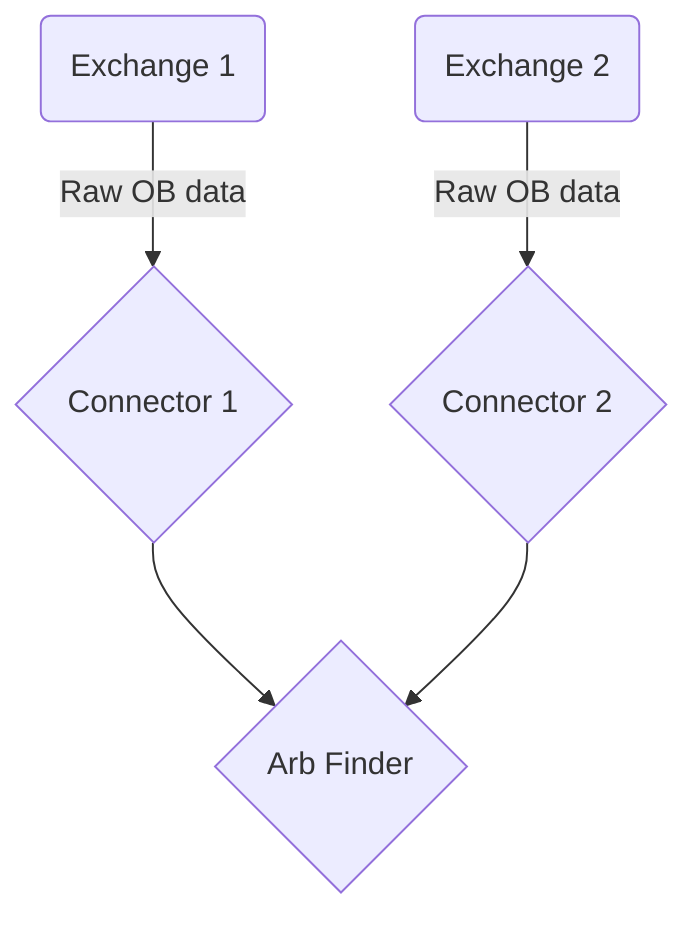

# Stream Orderbooks
We will connect to two different orderbook for BTCUSDT perp. The orderbook data will be fed into another component which will detect any arbitrage opportunity.

## Program structure
Will create a general exchange connector interface then implement the connect interface for two different exchanges.

The exchange will send raw json data. The connector will pass that into our data structure then send those objects to the arbitrage detector. The arbitrage detector will print any arbitrage opportunities to the terminal.

